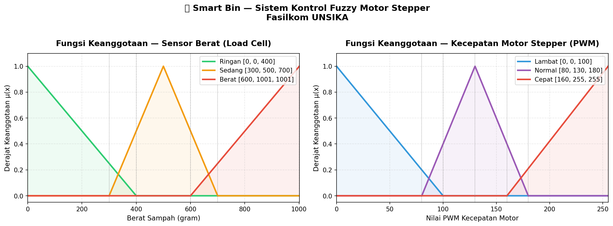

# 🧠 UTS Praktikum Kecerdasan Buatan
### Implementasi Gaussian Naive Bayes & Kontrol Logika Fuzzy

> **Ujian Tengah Semester — Mata Kuliah Kecerdasan Buatan**  
> Dosen Pengampu: **Yuyun Umaidah, M.Kom.**

---

| | |
|---|---|
| **Nama** | Muhammad Rizky Dermawan |
| **NPM** | 2410631170038 |
| **Kelas** | 4B – Informatika |
| **Program Studi** | Informatika — Fasilkom UNSIKA |
| **Tahun** | 2026 |

---

## 📁 Isi Repository

```
📦 uts-ai-naive-bayes-fuzzy/
├── 📄 README.md
├── 🍷 wine_quality_gaussian_nb.py     ← Soal 1: Gaussian Naive Bayes
├── 🤖 fuzzy_logic_smartbin.py         ← Soal 2: Logika Fuzzy
└── 📊 winequalityN.csv                ← Dataset Wine Quality
```

---

## 🍷 Soal 1 — Klasifikasi Kualitas Wine (Gaussian Naive Bayes)

**Studi Kasus:** PT. Global Winery Indonesia ingin mengotomasi penilaian kualitas wine yang sebelumnya dilakukan secara manual oleh sommelier, menggunakan data hasil uji laboratorium fisikokimia.

**Tujuan:** Memprediksi apakah wine layak masuk kategori **Bagus** (ekspor) atau **Biasa** (lokal) berdasarkan 11 parameter kimia.

| Label | Kondisi | Keterangan |
|-------|---------|------------|
| `1` — Bagus | Skor kualitas ≥ 6 | Layak ekspor |
| `0` — Biasa | Skor kualitas < 6 | Pasar lokal |

**Fitur Input (11 parameter kimia):**
`fixed acidity` · `volatile acidity` · `citric acid` · `residual sugar` · `chlorides` · `free sulfur dioxide` · `total sulfur dioxide` · `density` · `pH` · `sulphates` · `alcohol`

**Alur Implementasi:**
```
Load Dataset → Labeling Biner → Pisah per Kelas → 
Hitung Mean & Std → Prior → Gaussian PDF → Posterior → Prediksi
```

**Implementasi:** From scratch — tanpa scikit-learn, hanya `csv` dan `math` dari library standar Python.

**Hasil Akurasi:** `68.17%` pada 6.463 sampel

**Data Uji & Hasil Prediksi:**

| Fitur | Nilai | Fitur | Nilai |
|-------|-------|-------|-------|
| Fixed Acidity | 8.2 | Free SO₂ | 19 |
| Volatile Acidity | 0.45 | Total SO₂ | 172 |
| Citric Acid | 0.17 | Density | 0.993 |
| Residual Sugar | 19.2 | pH | 3.12 |
| Chlorides | 0.034 | Sulphates | 0.4 |
| Alcohol | 10.1 | | |

> **Prediksi → ⚠️ BIASA (Kelas 0)** — Pasar Lokal

---

## 🤖 Soal 2 — Kontrol Logika Fuzzy (Smart Bin Motor Stepper)

**Studi Kasus:** Tim AI & Robotic Fasilkom UNSIKA mengembangkan purwarupa Smart Bin yang memilah sampah secara otomatis ke ruang Organik / Anorganik / B3. Motor Stepper penggerak slider perlu dikontrol kecepatannya secara adaptif berdasarkan berat sampah agar tidak merusak mekanik.

**Variabel Fuzzy:**

| | Variabel | Himpunan | Rentang |
|---|---|---|---|
| **Input** | Sensor Berat (Load Cell) | Ringan | 0 – 400 gram |
| | | Sedang | 300 – 700 gram |
| | | Berat | 600 – 1001 gram |
| **Output** | Kecepatan Motor (PWM) | Lambat | 0 – 100 |
| | | Normal | 80 – 180 |
| | | Cepat | 160 – 255 |

**Rule Base:**

```
IF berat_sampah = Ringan  →  THEN kecepatan_motor = Cepat
IF berat_sampah = Sedang  →  THEN kecepatan_motor = Normal
IF berat_sampah = Berat   →  THEN kecepatan_motor = Lambat
```

**Fungsi Keanggotaan:** Triangular (`trimf`) — Defuzzifikasi: Centroid

**Hasil Simulasi:**

| Berat Sampah | Kecepatan PWM | Kategori |
|---|---|---|
| 50 gram | 222.89 | 🟥 Cepat |
| 300 gram | 213.15 | 🟥 Cepat |
| 500 gram | 130.00 | 🟦 Normal |
| 700 gram | 44.06 | ⬛ Lambat |
| 1001 gram | 33.33 | ⬛ Lambat |



---

## ⚙️ Cara Menjalankan

**Soal 1 — Gaussian Naive Bayes**
```bash
# Tidak perlu install library tambahan
python wine_quality_gaussian_nb.py
```

**Soal 2 — Logika Fuzzy**
```bash
pip install scikit-fuzzy matplotlib numpy
python fuzzy_logic_smartbin.py
```

---

## 🛠️ Teknologi


---

<div align="center">
  <sub>Program Studi Informatika · Fakultas Ilmu Komputer · Universitas Singaperbangsa Karawang · 2026</sub>
</div>
